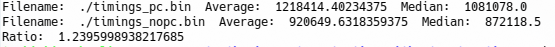
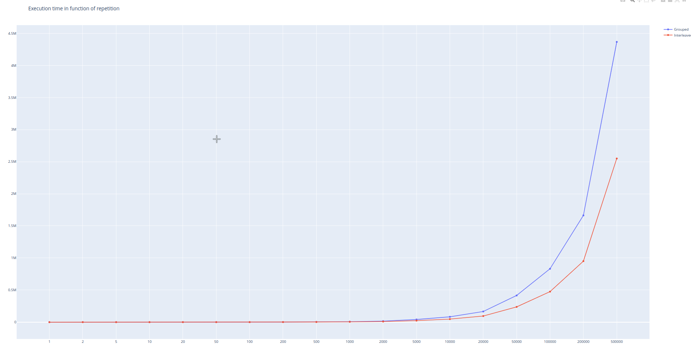
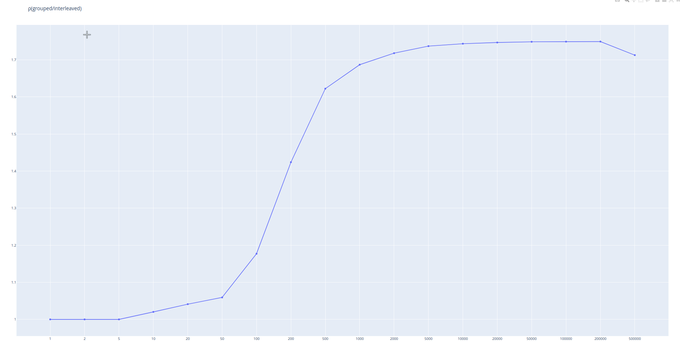
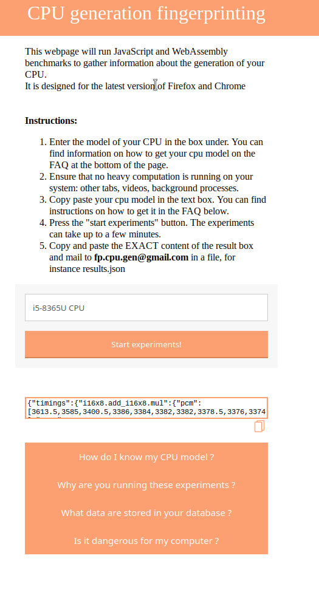
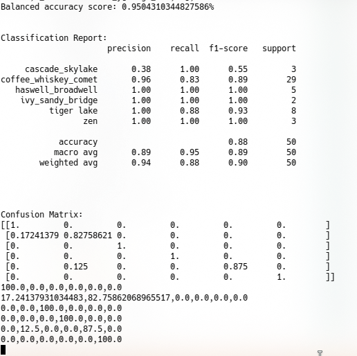
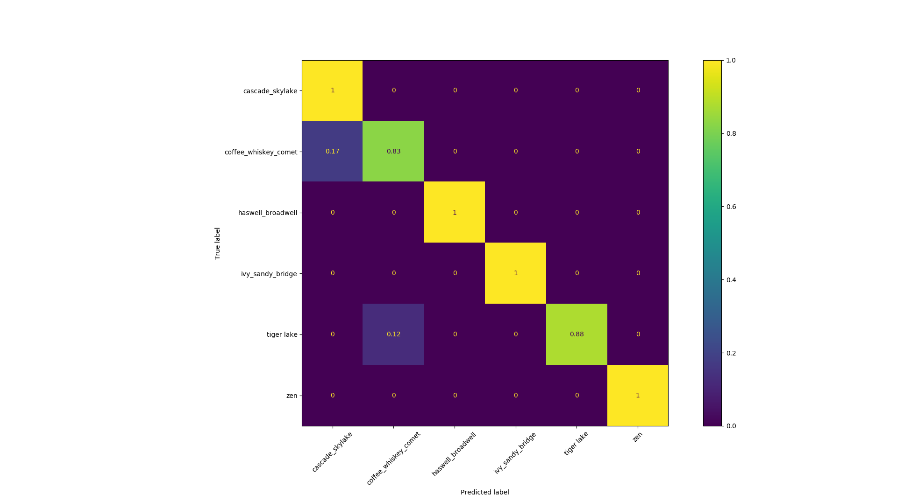

# CPU Port Contention Without SMT: Sources

This repository contain all the code, frameworks and evaluation data for the paper "CPU Port Contention Without SMT" by [Thomas Rokicki](https://thomasrokicki.github.io/#home), [Clémentine Maurice](https://cmaurice.fr/) and [Michael Schwarz](https://misc0110.net/). It has been published at ESORICS 2022.
You can find the full paper [here](https://hal.science/hal-03798342v1).

For any questions about the article, contact me at  thomas.rokicki [at] centralesupelec.fr

## Prerequisites
Most experiments have been run on recent Linux distributions.
Although portable code should work on other OSs, we have experienced some issues on MacOS, probably due to the differences in scheduling and SharedArrayBuffer Clocks.

You will need to install [wabt](https://github.com/WebAssembly/wabt) to compile the WebAssembly files from the wat text format.
Note that, at the time of making the paper, the apt version of wabt was not recent enough to build WebAssembly's SIMD instructions, and required to build the git sources to use the frameworks.

Most native code for the framework and classifier require python3 to work. Run `pip3 install -r requirements.txt` to install necessary dependencies.

## Native Proof of Concept

This proof of concept is stored in the native_poc folder.
It tests the sequential port contention with native code, directly calling x86 instructions and timing it with rdtsc.

### Principle

The proof of concept uses two x86 instructions, (instr1,instr2).
It executes the two function grouped and interleaved defined in the article, then compares their execution time.

### Simple setting

To test with a simple setting, set the desired instructions in native/src/seq_pc.S, at lines with the flag instruction_1 or instruction_2
You can also change the number of lines tested by changing the parameters of the .rept (#repetition flag)
Then you can run it with

```
mkdir build
make
./build/seq_pc #  Output data to the data/folder
python3 parse.py # Parses the bin files and output stats
```

The results should be outputted in the console as such:



Timings_pc corresponds the grouped function, always creating contention.
Timings_nopc corresponds to the interleaved function, creating contention only if instr1 and instr2 have a similar port usage.

### Automated plot

It may be interesting to quantify the variation of the execution time ratio with repetitions.
In particular, it allows to see the size of the lookahead window (inflexion point)
There is also a python script to vary instructions and number of lines automatically and plot the evolution of the median and the ratio.
You need to have plotly installed (pip install -r requirements.txt)

```
python3 parse.py
```

The result should be two graphs opened in the browser.



The first graph illustrates the evolution of the execution of both functions in function of the number of repetitions.
Two scenarios may occur: if both instructions (instr1,instr2) use different port, grouped function will create contention while interleaved will not, resulting in a difference in execution time and two different curves as illustrated above.
If they share a port, both functions will be slowed down by port contention and result in overlapping curves.



The second graph illustrates the evolution of the ratio (grouped/interleaved). If it is higher than 1, then grouped creates contention while interleaved does not. It is also useful to visualize the inflexion point around 64 repetitions, due to the size of the lookahead window.

## WebAssembly Framework

Situated in ./framework

We can create sequential contention with the same experiments in WebAssembly.
However, as we don't know the translation of wasm instructions to native instructions (as it depends on the engine and cpu), we need to empirically determine which pairs of instructions create sequential contention or not.

In particular, as port usage for instructions change with generations, knowing which instructions create contention on a specific system could leak information about the cpu vendor or generation.

This framework evaluates all pairs of instructions defined in instrucitons.py and check whether or not they share cpu ports.
By comparing the results from different systems, we can find distinguishers, i.e. pairs of instructions that behave differently on different generations.

### How to use

Go to the framework directory.

First, you need to build the WebAssembly files:

```
python3 wasm_generator.py
make # you can use -j flag to multithread as there are a lot of files to build.
```
Now, you need to start the local server:
```
python server.py &
```

Then, you can run the framework:

```
python3 framework.py
```

You can modify the number of iterations and the result folder with parameters:

| short  | long    |       help                  | values | default |
| :----: |:-------:| :--------------------:|:------:| :-----: |
| -i    | --iterations | Number of experiment iterations (hence number of result files). |   int  | 100   |
| -o   | --output | Output directory |   str  | ./results/   |

A result file is typically a json file, containing, for each pair of instructions, the execution time of grouped and interleaved functions measured in SharedArrayBuffer increments.
By comparing both values, you can determine whether or not the pair of instructions share a similar port on this microarchitecture.


## Data Gathering
Know that we have data for online training, we can gather arbitrary online data to be classified.
To do so, we have designed a small website, source available in ./website
You can also access a live version of the site  [here](https://fp-cpu-gen.github.io/fp-cpu-gen/index.html).




The usage of this site is meant to be simple, it tests all distinguishers 10 times and return timings.
Simply enter the processor model (information on how to retrieve it can be found in the FAQ below on the page. ) and click start experiment.
At the end of the computing, a window appears and you can copy the results to feed them to the classifier (or send them to us so we have a better evaluation :D !).

## K-NN Classifier

Folder `./classifier` contains the sources of a K-NN based classifier to determine the generation of visitors of the previous website.
It parses the results given by the site and output a guess on its generation thanks to the training data gathered with the framework.

Use `python3 classify.py` to train and evaluate the knn model on the same dataset than in the paper.
The classifier can take several parameters in input:

| short  | long    |       help                  | values | default |
| :----: |:-------:| :--------------------:|:------:| :-----: |
| -n | --neighbors | Number of knn neighbors | int | 3 |
| -d | --distance | Distance used for knn | str | 'euclidean' |
| -m | --mv_size | Size of the majority-voting window | int | 10 |
| - | --grouped / --Ungrouped | Classify with groups of similar generations. Default is grouped| Bool | True |
| - | --balanced / --Ungrouped | Used balanced dataset. Default is balanced | Bool | True |
| - | --self_fit / --no-self_fit | Evaluate / skip the knn on data from the training set. Default is no-self_fit | Bool | False |
| - | --evaluation_fit / --no-evaluation_fit | Evaluate / skip the knn on evaluation data. Default is evaluation_fit | Bool | True |
| -s | --save_matrix | Save confusion matrix as png | Bool | False |
| - | --evaluation_path  | Path for evaluation data | str | './evaluation_data/' |

The classifier will then output stats about the classification and evaluation.



The confusion matrix is also outputted with matplotlib:




Feel free to enrich the dataset with other data traces !
